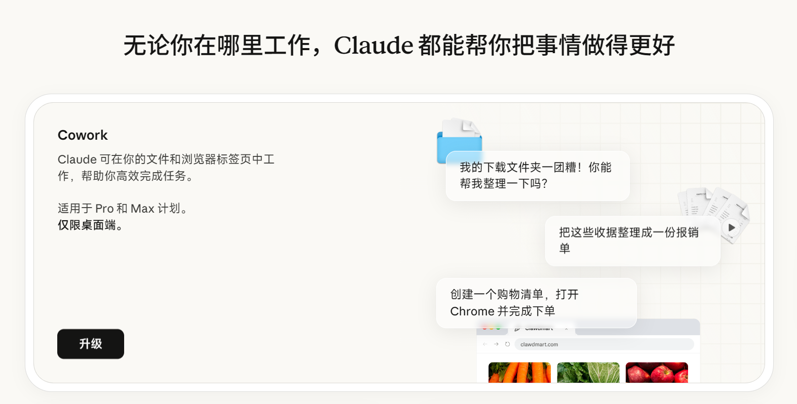

# Claude Translator（Claude.ai 中文化脚本）



这是一个给 `claude.ai` 使用的中文化用户脚本（Tampermonkey/Greasemonkey）。

目标是：
- 把 Claude 页面中的英文界面文案翻译成中文；
- 兼容 Claude 的动态页面刷新（React 重绘后仍能持续翻译）；
- 不影响聊天输入和模型输出正文（避免误翻译对话内容）。

项目当前采用“单文件运行 + 模块化维护”的方式：
- 运行与安装统一使用 `claude-translator.js`；
- 词库维护可看 `src/i18n/*`（可选）。

---

## 项目结构（看不懂也没关系）

```text
claude-translator/
├─ claude-translator.js                 # 主脚本（开发时可直接改）
├─ claude-translator.backup.phaseAB.js  # 备份文件
├─ src/
│  └─ i18n/                              # 拆分词库（可选维护方式）
├─ scripts/
│  ├─ build-userscript.js                # 历史构建脚本（可不使用）
│  └─ check-duplicate-keys.js            # 检查重复 key
└─ docs/
   ├─ REGRESSION_CHECKLIST.md
   ├─ MIGRATION_STATUS.md
   └─ BUILD_SINGLE_FILE.md
```

---

## 快速使用

1. 安装 Tampermonkey。
2. 把 `claude-translator.js` 内容复制进去保存。
3. 打开 `https://claude.ai/` 刷新页面。

---

## 零基础教程：自己添加汉化文本

下面是给“完全没写过代码的人”的最简流程。

### 第 1 步：决定你要改哪一类文本

你看到的英文，大致分三类：

1. `static`（固定文本）
   - 例如：`Settings`、`Get help`
   - 最常用、最简单。

2. `regexp`（带数字/变量）
   - 例如：`5 hours ago`、`129 chats with Claude`
   - 文本会变化，不能用固定匹配。

3. `selector`（侧栏/按钮这类容易被重绘的区域）
   - 例如：左侧菜单 `New chat`。
   - 用 CSS 选择器直接命中元素，更稳。

---

### 第 2 步：添加 static（最推荐先学这个）

打开 `claude-translator.js`，找到 `I18N.public.static`，按下面格式加一行：

```js
"Get help": "获取帮助",
```

规则：
- 左边是页面英文原文（要求必须完全一致）；
- 右边是你的中文；
- 每行末尾保留逗号。

---

### 第 3 步：添加 regexp（处理数字变化）

如果文本像 `3 hours ago` 这种会变数字，请加到对应 `regexp` 数组（通常在 `chat.regexp` 或 `public.regexp`）。

示例：

```js
[/^(\d+)\s+hours?\s+ago$/i, "$1 小时前"],
```

说明：
- `(\d+)` 代表数字；
- `$1` 表示把匹配到的数字放回译文。

---

### 第 4 步：添加 selector（侧栏按钮不生效时用）

加到 `selector` 数组，格式如下：

```js
["a[aria-label='New chat'] span", "新建对话"],
```

如果你不懂选择器，先抄已有规则，改英文目标词即可。

---

## 每次修改后必做

每次你改完翻译词条后，直接更新 `claude-translator.js` 到油猴即可。

如果你改的是 `src/i18n/*`（例如 `public-static.js`），必须先执行：

```bash
node scripts/build-userscript.js
```

该命令会把词库同步写回 `claude-translator.js`（这个才是油猴自动更新用的主文件）。

如果你采用 GitHub 自动更新：
- 保证已从仓库 Raw 地址安装脚本；
- 每次发布记得递增 `@version`。
